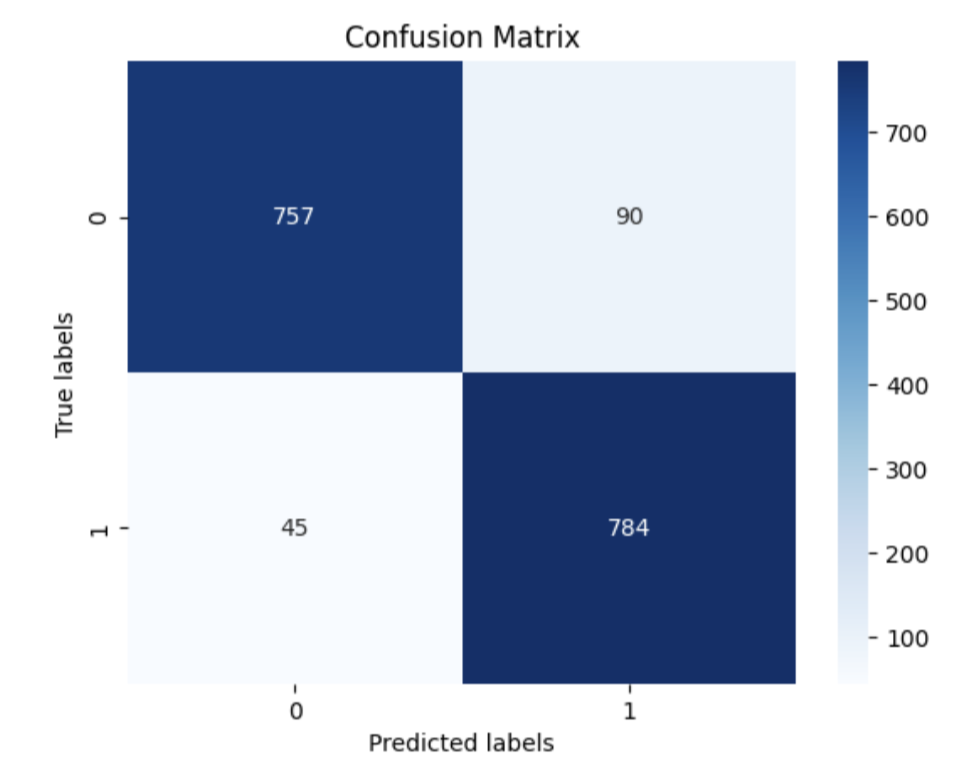

# CSE 151A Matchmaker

Link to our Jupyter notebooks (also linked throughout write up): 
* MS2: [https://colab.research.google.com/drive/17Tuyk_vncUdV1RXNU-dlD5jrgjd07v-H?usp=sharing](https://colab.research.google.com/drive/17Tuyk_vncUdV1RXNU-dlD5jrgjd07v-H?usp=sharing)
* MS3: [https://colab.research.google.com/drive/1z7sOpXUmxRID6vVpQlkCrXNFihgwi_LU?usp=sharing](https://colab.research.google.com/drive/1z7sOpXUmxRID6vVpQlkCrXNFihgwi_LU?usp=sharing) 
* MS4: [https://colab.research.google.com/drive/1mJI34SCPfBrJ7Xdx65e0Myvi7k0Eox3U?usp=sharing](https://colab.research.google.com/drive/1mJI34SCPfBrJ7Xdx65e0Myvi7k0Eox3U?usp=sharing)
* MS5: [https://colab.research.google.com/drive/1-D_WYKVvO-rNaSWxxmgSMwctafu7_UzA?usp=sharing](https://colab.research.google.com/drive/1-D_WYKVvO-rNaSWxxmgSMwctafu7_UzA?usp=sharing)

Link to Dataset: https://www.kaggle.com/datasets/ulrikthygepedersen/speed-dating/data \
The csv to the out dataset is also on the repository. 


# Introduction

Finding a match in the 21st century can be a challenge, especially when, little to your knowledge, the person you are destined to be with may very well be in your CSE 151A lecture hall. In this project, we aim to use a comprehensive speed dating dataset analyzing demographics, dating habits, self-perception across key features, and more, between matched and unmatched pairs, to predict whether two people of certain attributes will match. The dataset is tabular and comprises thousands of observations of people’s own traits and interests. The last field is whether or not they ended up being a match, which is our target attribute. We wanted to use some of the data in here as metrics to generate a predictive model that, when given similar data about 2 different people, can predict whether or not they will be a match.

The implications of developing this predictive model based on the dataset could be transformed into a dating application that replicates the speed-dating questionnaire process without program components that require a physical meetup. By analyzing questionnaire responses that include demographic information, personal interests, self-assessments, and perceptions of others, this model aims to uncover the underlying factors that contribute to successful matches. Such a model could be instrumental in enhancing the algorithms behind dating apps, enabling them to offer more personalized and accurate match recommendations.

Potential applications of this model in a dating app context are vast. For instance, the app could use the model to refine its matching algorithms, taking into account not just the superficial preferences but also the nuanced aspects of attraction and compatibility revealed by the dataset. This could lead to more meaningful connections by matching individuals based on deeper levels of compatibility, such as shared values, interests, and mutual perceptions of attractiveness. Furthermore, insights gained from the model could assist in the development of features that encourage users to explore potential matches they might not have considered otherwise, thereby expanding their horizons and increasing the chances of forming successful relationships.

Moreover, this approach opens up possibilities for dynamic feedback mechanisms where the model adjusts and learns from the outcomes of its predictions, thereby improving its accuracy over time. As the app collects more data on matches and user interactions, it could continuously refine its understanding of what makes a successful match, leading to ever-improving recommendations for its users. This not only enhances user satisfaction but also positions the app as a leader in leveraging advanced machine learning techniques to foster human connections.


# Methods


## Data Exploration

Link to Data Exploration Notebook:

[https://colab.research.google.com/drive/17Tuyk_vncUdV1RXNU-dlD5jrgjd07v-H?usp=sharing](https://colab.research.google.com/drive/17Tuyk_vncUdV1RXNU-dlD5jrgjd07v-H?usp=sharing)

To explore the data, we first converted our csv file to a dataframe, and skimmed through all the data that is available. We checked for missing data, the different types of each feature, the shape of the data frame etc. 


## Preprocessing

It was decided that the relevant data is the difference between preferences of two people. This means that we need to drop all irrelevant columns. After dropping, the values were string values representing a range of values, so these values need to be encoded to represent actual integer values. Then, the output values in the matching column also needed to be encoded, so we first converted the string values to 0's and 1's, then used one-hot-encoding to create two columns: match and no match.


## Model 1

Link to Model 1 Notebook:
 [https://colab.research.google.com/drive/1z7sOpXUmxRID6vVpQlkCrXNFihgwi_LU?usp=sharing](https://colab.research.google.com/drive/1z7sOpXUmxRID6vVpQlkCrXNFihgwi_LU?usp=sharing)

[draft notebook with hyperparameter tuning -- not the final submission, just trials]
[https://colab.research.google.com/drive/1YiTdME0R0TYR0eGEjBOzBj24NQI2w02b?usp=sharing](https://colab.research.google.com/drive/1YiTdME0R0TYR0eGEjBOzBj24NQI2w02b?usp=sharing)

Our first model is a simple neural net. After messing around with hyperparameter tuning, we settled on a neural net with 5 dense layers, with the first 4 having 12 nodes and the last layer having 2. We used the sigmoid activation function on each layer, and optimized the model with stochastic gradient descent with a learning rate of 0.1. The loss function used was categorical cross entropy.


## Model 2

Link to Model 2 Notebook:

[https://colab.research.google.com/drive/1Wfwq86W_myw6D7NHexcekC2eitLdB0yb?usp=sharing](https://colab.research.google.com/drive/1Wfwq86W_myw6D7NHexcekC2eitLdB0yb?usp=sharing)

Our second model is a Decision Tree. Our tree used entropy as the criterion for splits and had a maximum depth of 5. Here is what our final tree looks like:


## Model 3

Link to Model 3 Notebook:

[https://colab.research.google.com/drive/1-D_WYKVvO-rNaSWxxmgSMwctafu7_UzA?usp=sharing](https://colab.research.google.com/drive/1-D_WYKVvO-rNaSWxxmgSMwctafu7_UzA?usp=sharing)

Our final model is a Support Vector Classifier, implemented with sklearn’s svm.SVC library. After using random search, we settled on using a radial basis function kernel, a gamma value of 0.001 and 10 for our C. 


# Results


## Data Exploration

The first thing we noticed was the sheer number of features (123 columns in total). We first decided to narrow down the features to those that started with a "d", i.e. those that represented the difference in answers between the two people. These data points reflect a direct relationship between the two participants, and are hence relevant to our project. Because we are doing more of a blind-dating matchmaker, we will not be using the features that require the participants to meet (eg. how attractive do you think your partner is, how likely do you think they will like you etc).

We can then further split the "difference" data into 2 subsections: difference in hobby ratings and difference in importance of a certain trait in partner. We plotted heatmaps and pairplots, and the correlations of individual features and the match class seem relatively weak. Differences in interest in art seem to have the highest correlation, but that is still a meager 0.038. Similarly for difference in importance of traits, "funny" has a correlation of 0.035 with match, and that is the highest value.


It is too soon to make any concrete conclusions, but this informs us that our model will need to be more complex than a simple logistic regression model, which has drawbacks when dealing with complex patterns and non-linear relationships in data. At this stage, we are still considering random forest classifier models and multi-layer perceptron neural networks, with the latter as our more likely choice due to the sheer volume of the data we have in this data set.


## Model 1

Classification Report:


Confusion Matrix:


At the end of 100 epochs, the trained model boasts a train MSE of 0.1241544 and a test MSE of 0.16587113. The train accuracy is 0.8733, and the test accuracy is 0.8437. 


## Model 2


Classification Report:


Confusion Matrix:


After tuning our decision tree, our tree had a mse of 0.1567 for our training data and 0.1695 for our testing data.


## Model 3
Classification Report:


Confusion Matrix:




After using Random Search for hyperparameter tuning, we landed on a train accuracy of 0.91945 and a test accuracy of 0.91945. 


# Discussion 


## Preprocessing 

We used the same preprocessing methodology throughout the 3 models, and as it worked out quite well from the very beginning. We cleaned our data of 8378 observations with 123 features to 56 features, and we encoded the data as the original data was composed of strings of numerical ranges. We ended up averaging the ranges which would be the encoding for that feature, for example ‘[3-5]’ would turn into 4. This made the values a lot easier to work with for our model. There were a lot of potentially useful features that we did not use, considering we dropped more than half of the features of the original dataset. However, we believe that the data we chose to use was the most relevant to what we wanted to prove. 


## Model 1 

We used grid search to find the best hyperparameters for this model, which produced a neural net of 5 dense layers, with 12 nodes each (except for the final layer, which has 2 nodes), and used sigmoid as the activation function. The model used stochastic gradient descent as the optimizer, and categorical cross entropy as the loss function. These parameters resulted in the following training and test accuracies:

1. Training set accuracy: 0.8733
2. Test set accuracy: 0.8437

Our neural net seems to fit well--perhaps even somewhat of a best-fit! The trained model boasts a train MSE of 0.13509749 and a test MSE of 0.1443914. When observing the MSE of the model as it trains, it decreases from 0.169 to 0.101 and the val_mse decreases concurrently from 0.160 to 0.106, and the two eventually converge. It is expected that the test and val have a slightly higher MSE as the train MSE. Additionally, the accuracy starts at 0.82 and increases to end at 0.87, as the validation accuracy also follows a similar increasing trend starting at 0.85 to 0.86.


On the fitting graph, our model falls near the line of best fit since the test MSE and train MSE both decrease over time and somewhat converge, but the test MSE is still higher than that of the train.

As seen in our classification report, our model is relatively good at predicting non-matches in both precision and recall, but does not do as well in predicting matches. match-predicting issue. This makes sense, given that in the dataset (and in real life), we are much more likely to meet non-matches than matches, leading to an imbalanced dataset. If we end up reworking our models, we can consider resampling to counteract this issue.


## Model 2

For this milestone we implemented a decision tree for our classification task. We used grid search to find the best hyperparameters for this model, which resulted in the following training and test accuracies:

3. Training set accuracy: 0.8433
4. Test set accuracy: 0.8455

After plotting the learning curve, you can see the train score and test score converge, which suggests that the model is a good fit and not overfitting.


As seen by the accuracies above, our model was a good fit for the data as our training and test accuracies were very similar. Furthermore upon inspection of the tree diagram, we saw that there were 31 leaf nodes and 5 layers which we believed to be a good amount in relation to the number of observations. We also saw that each leaf node had at a minimum 9 observations which is not low enough to suggest overfitting. Grid search assisted in ensuring that our model would be a good fit for our data as it searched for the best hyperparameters and did 5 fold cross validation. In the last milestone we were able to achieve 0.87 accuracy on the training set and 0.86 accuracy on the test set by training a neural network. Although the decision tree did worse than the neural network, we are happy to find that it came within 2-3% accuracy of the neural network.

Initially we tuned the hyper parameters by hand for the decision tree but then we implemented grid search which was able to automatically find the best parameters. The best parameters for our speed dating dataset turned out to be:


    criterion: entropy
    max_depth: 5
    min_samples_leaf: 2
    min_samples_split: 4

Furthermore we performed 5 fold cross validation in order to better utilize our data and avoid overfitting which resulted in our best model achieving a near 0.85 accuracy.

The model works well enough, and we don't think it's very possible to improve the decision tree classifier we used more than we already have. We used hyper parameter tuning to improve the model's accuracy, but it stayed around the same number. Pruning the tree in different ways could possibly improve the model's accuracy as well. We've tried to do Cost-complexity pruning, however, it made no effect on our model, but we could potentially try other pruning methods like weakest link pruning to better the model.


## Model 3

Our SVC has the highest test and training accuracy of all our models so far, sitting at 0.91945 for both.The confusion matrix also looks extremely promising. Plotting our training score against cross-validation score, it does not seem like the model is overfitting either. 


It is not converging quite as closely as our decision tree, but we are happy to see that the train vs test scores are not diverging yet, as that we mean that we implemented too complex of a model. 

We performed hyperparameter tuning with Random Search, fitting 3 fold for 7 iterations, totalling 21 fits. The parameter list we searched over was as follows:


```
param_list = {
   'C': [0.1, 1, 10, 100],
   'gamma': [0.001, 0.0001, 'scale', 'auto'],
   'kernel': ['linear', 'rbf', 'poly']
}
```


The best parameters found were rbf for our kernel, 0.001 for gamma and 100 for C.

The only suspicious thing to note is that our test and train accuracy are the exact same. We are unsure if this implies a problem with our implementation of the model, or if the data just worked really well with the SVC. One thing we could have done better would be trying out different splits of the training data to see if this behavior is consistent across all versions. We could also have tried implementing a basic SVM, as we are more familiar with how that SVM would work given that we learnt about it in lecture.

With that, we wrap up our last model. It is our most accurate model yet, but it is also the least interpretable, being basically a black box to us. All we know is the parameters used, but it is hard to visualize where all the points lie as we are dealing with 56 dimensions. 	


# Conclusion 

Each model comes with its pros and cons, so it is hard for us to pick the best or our favorite one. Despite boasting the highest accuracy, we find it hard to fully trust the SVC, and would require more testing with more data to believe that the SVC is as good as it seems. Our neural net is still relatively simple, and with more time, we can consider expanding the model and playing around more with hyperparameter tuning. With over 50 features, 5 layers might be a bit too little to produce accurate predictions. That being said, it is important that we do not go overboard and generate an overly complex model. Our decision tree seems promising, and we really like how the learning curve looks as it seems to be at the sweet spot of convergence between training and test score. Given the more interpretable nature of decision trees, it feels safer to trust the results of this model as we can see the exact steps that were traversed down the tree to arrive at the final prediction.

A few things we wished we did differently: We could have considered ways to incorporate the other 60+ features that we dropped. There could have been a lot of insightful information in there, but encoding and preprocessing all that data proved to be a challenge, especially during the first half of the quarter when we first started working on this project. More time could have been spent exploring other models and hyper parameter tuning. We performed grid search and random search on all of our models, but the parameter list we used was far from exhaustive. If we had the computing power and time, we would have liked to try to push the limits of the accuracy we can get.

It is also important to note that the data used is from two decades ago, and the data used is a very superficial benchmark for whether or not two people will get along. We still think it was a fun project to play around with, and we would love to extend on the project in the future. This would be done with newer and better data, as well as exploring different models, or reworking what we have done so far. 

	


# Collaboration 

Kenna: Worked on the code for the data exploration notebook and wrote the preprocessing readme file. Debugged the last model and wrote the evaluation for it. Wrote the final write up (restructured readme from previous submissions, wrote the discussion and evaluation for model 3, wrote the conclusion). 

Alon: Worked on the code and documentation for milestone 4 as well as the questions for milestone 4. 

Shruti: Worked on the code/documentation for the milestone 4 notebook and wrote the answers/writeup for the questions for milestone 4 into the readme. 

Sonia: Worked on code and documentation for milestone 3 notebook and answered the readme questions for milestone 3. Additionally, I created the website that uses a modified version of our milestone 3 model to predict matches :-)

Kaleigh: Worked on code and documentation for milestone 3 notebook and wrote answers for questions in the readme as well as documentation in the notebook itself. Collaborated in assessing which model to choose for the task. 
